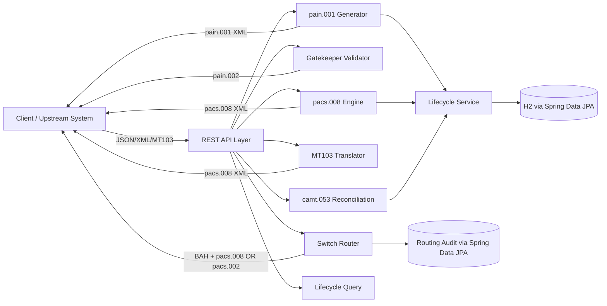
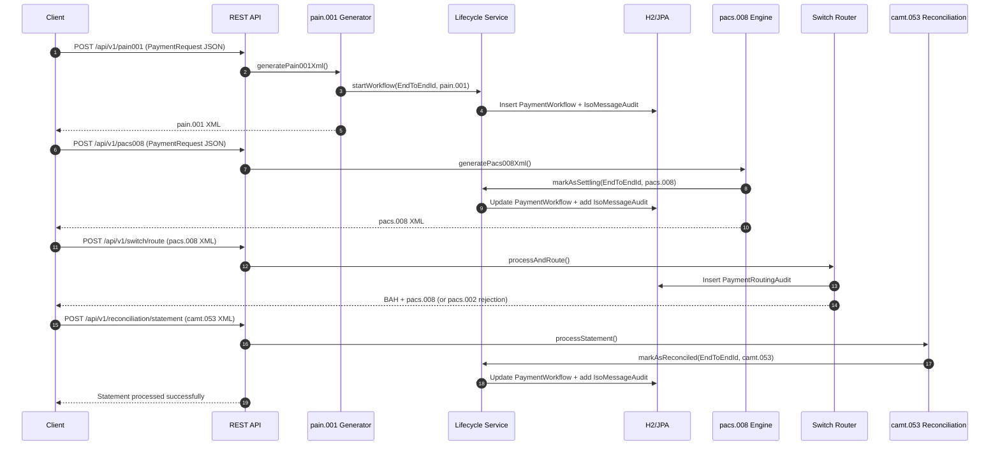
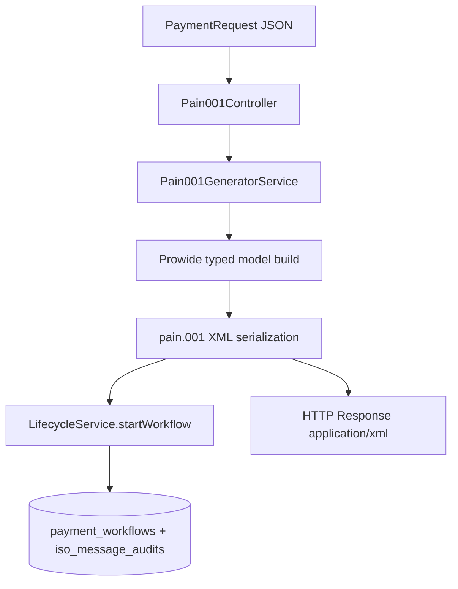
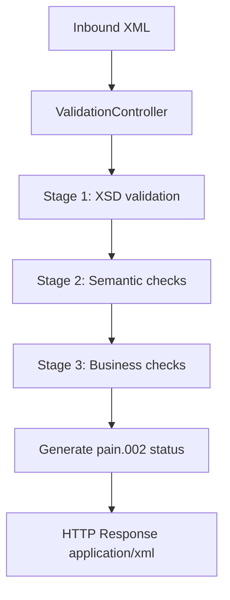
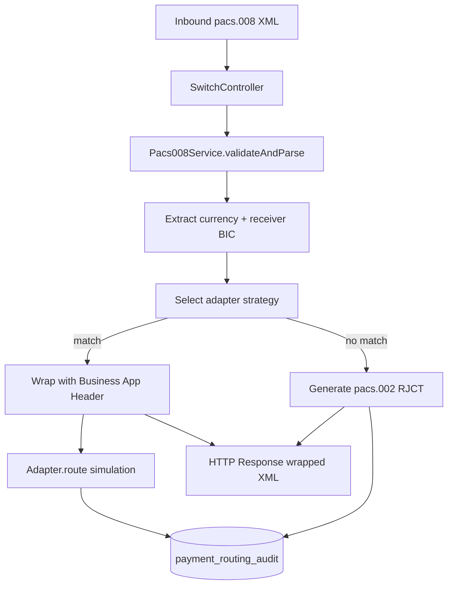

# ISO 20022 Gateway (Generation, Validation, Routing, Lifecycle, Reconciliation)

A Spring Boot (Java 17) project that demonstrates an end-to-end ISO 20022 “mini-gateway”:
- Generate customer and interbank messages (`pain.001`, `pacs.008`)
- Validate inbound ISO 20022 messages (XSD + semantic + business rules)
- Translate legacy SWIFT FIN (`MT103`) into ISO 20022 (`pacs.008`)
- Route interbank settlement messages through a “switch” using strategy-based adapters and BAH wrapping
- Track the payment lifecycle across message types using `EndToEndId` and persist audit trails
- Reconcile payments from bank statements (`camt.053`) to close the lifecycle

Built completely around the robust **Prowide ISO 20022 open-source library**, this tool handles all the complex hierarchical mappings—like transforming a flat representation into the standards-compliant `GroupHeader`, `PaymentInformation`, and `CreditTransferTransactionInformation` structures.

## 🧭 Project Map (Modules)

- **pain.001 (Customer Initiation)**: JSON → `pain.001.001.11` XML generation + lifecycle start
- **Gatekeeper Validation**: inbound XML validation → standards-based status responses (`pain.002.001.10` / `pacs.002.001.12`)
- **pacs.008 (FI-to-FI Settlement)**: JSON → `pacs.008.001.10` XML generation + lifecycle transition
- **Legacy Bridge**: MT103 text → `pacs.008` object model + XML response
- **Switch (Routing)**: inbound `pacs.008` validation + BAH wrapping + adapter routing + routing audit / rejection (`pacs.002.001.12`)
- **Lifecycle & Audit**: persisted “golden thread” correlation across message types using `EndToEndId`
- **Reconciliation**: inbound `camt.053.001.10` scan → match `EndToEndId` → lifecycle reconciliation

## 🧩 High-Level Design (HLD)

### Component View



### Runtime & Data Stores

- **Runtime**: Spring Boot 3.4.x, Java 17, Maven
- **ISO/MX Model**: Prowide `pw-iso20022` (SRU2023)
- **Legacy FIN Parsing**: Prowide `pw-swift-core`
- **Persistence**: Spring Data JPA + H2 (runtime)
  - `payment_workflows` + `iso_message_audits` for lifecycle and message payload audit
  - `payment_routing_audit` for switch routing decisions

## 🚀 Key Features

- **Java 17+ & Spring Boot 3.x Ready**: Built using the latest standards and specifically patched for JDK versions that removed the legacy `javax.xml.bind` packages.
- **Prowide ISO 20022 Integration**: Leverages the official schemas provided by SWIFT and standardized by Prowide to ensure 100% adherence to standard XML paths and attribute properties.
- **REST Interface Built-In**: Includes a RESTful endpoint to supply payment context payload as JSON while receiving perfectly formatted and indented XML strings.
- **Automatic Fields**: Automatically handles `MsgId`, `CreDtTm`, `NbOfTxs`, `CtrlSum`, and auto-generates End-to-End identification components safely.

## API Surface (Endpoints)

- **Generate `pain.001`**: `POST /api/v1/pain001` (JSON → XML)
- **Validate `pain.001`**: `POST /api/v1/validate/pain001` (XML → `pain.002`)
- **Generate `pacs.008`**: `POST /api/v1/pacs008` (JSON → XML)
- **Validate `pacs.008`**: `POST /api/v1/validate/pacs008` (XML → `pacs.002`)
- **Translate MT103 → `pacs.008`**: `POST /api/v1/translator/mt103` (text/plain → XML)
- **Switch Route `pacs.008`**: `POST /api/v1/switch/route` (XML → wrapped XML or `pacs.002`)
- **Upload `camt.053`**: `POST /api/v1/reconciliation/statement` (XML → text acknowledgement)
- **Lifecycle Query**:
  - `GET /api/v1/lifecycle/{endToEndId}`
  - `GET /api/v1/lifecycle/all`

## Requirements

- **Java 17** or higher
- **Maven** 3.8+

## 🏁 How to Run

1. **Clone the repository** (if you haven't already):

   ```bash
   git clone https://github.com/awoedey2k/Pain001-Generator.git
   cd "Pain001-Generator"
   ```

2. **Clean & Build**:

   ```bash
   mvn clean install
   ```

3. **Start the Application**:

   ```bash
   mvn spring-boot:run
   ```

   > The application launches on default port `8080`.

## 🛠️ Usage Example

You can generate the XML on the fly by hitting the provided endpoint utilizing `cURL` or Postman.

**Endpoint**: `POST http://localhost:8080/api/v1/pain001`
**Header**: `Content-Type: application/json`

**Sample Request Payload:**

```json
{
  "debtorName": "Acme Corporation",
  "debtorIban": "DE89370400440532013000",
  "debtorBic": "COBADEFFXXX",
  "creditorName": "Widget Supplies Ltd",
  "creditorIban": "GB29NWBK60161331926819",
  "creditorBic": "NWBKGB2L",
  "amount": 1500.00,
  "currency": "EUR",
  "endToEndId": "INV-2026-00042",
  "remittanceInfo": "Invoice 2026-00042 payment"
}
```

**Expected XML Response (`application/xml`):**

```xml
<?xml version="1.0" encoding="UTF-8" ?>
<Doc:Document xmlns:Doc="urn:iso:std:iso:20022:tech:xsd:pain.001.001.11">
    <Doc:CstmrCdtTrfInitn>
        <Doc:GrpHdr>
            <Doc:MsgId>MSGID-20260412123300-4fe65c60</Doc:MsgId>
            <Doc:CreDtTm>2026-04-12T12:33:00</Doc:CreDtTm>
            <Doc:NbOfTxs>1</Doc:NbOfTxs>
            <Doc:CtrlSum>1500.00</Doc:CtrlSum>
            <Doc:InitgPty>
                <Doc:Nm>Acme Corporation</Doc:Nm>
            </Doc:InitgPty>
        </Doc:GrpHdr>
        <Doc:PmtInf>
            <Doc:PmtInfId>PMTINF-4fe65c60-b12</Doc:PmtInfId>
            <Doc:PmtMtd>TRF</Doc:PmtMtd>
            <Doc:NbOfTxs>1</Doc:NbOfTxs>
            <Doc:CtrlSum>1500.00</Doc:CtrlSum>
            <Doc:ReqdExctnDt>
                <Doc:Dt>2026-04-12</Doc:Dt>
            </Doc:ReqdExctnDt>
            <Doc:Dbtr>
                <Doc:Nm>Acme Corporation</Doc:Nm>
            </Doc:Dbtr>
            <Doc:DbtrAcct>
                <Doc:Id>
                    <Doc:IBAN>DE89370400440532013000</Doc:IBAN>
                </Doc:Id>
            </Doc:DbtrAcct>
            <Doc:DbtrAgt>
                <Doc:FinInstnId>
                    <Doc:BICFI>COBADEFFXXX</Doc:BICFI>
                </Doc:FinInstnId>
            </Doc:DbtrAgt>
            <Doc:CdtTrfTxInf>
                <Doc:PmtId>
                    <Doc:InstrId>INSTR-abf05f10</Doc:InstrId>
                    <Doc:EndToEndId>INV-2026-00042</Doc:EndToEndId>
                </Doc:PmtId>
                <Doc:Amt>
                    <Doc:InstdAmt Ccy="EUR">1500.00</Doc:InstdAmt>
                </Doc:Amt>
                <Doc:CdtrAgt>
                    <Doc:FinInstnId>
                        <Doc:BICFI>NWBKGB2L</Doc:BICFI>
                    </Doc:FinInstnId>
                </Doc:CdtrAgt>
                <Doc:Cdtr>
                    <Doc:Nm>Widget Supplies Ltd</Doc:Nm>
                </Doc:Cdtr>
                <Doc:CdtrAcct>
                    <Doc:Id>
                        <Doc:IBAN>GB29NWBK60161331926819</Doc:IBAN>
                    </Doc:Id>
                </Doc:CdtrAcct>
                <Doc:RmtInf>
                    <Doc:Ustrd>Invoice 2026-00042 payment</Doc:Ustrd>
                </Doc:RmtInf>
            </Doc:CdtTrfTxInf>
        </Doc:PmtInf>
    </Doc:CstmrCdtTrfInitn>
</Doc:Document>
```

## 🛡️ Gatekeeper Validation Engine

This project also includes a robust, multi-stage validation pipeline for incoming `pain.001` messages.

**Endpoint**: `POST http://localhost:8080/api/v1/validate/pain001`
**Header**: `Content-Type: application/xml` OR `text/xml`

The Gatekeeper enforces:

1. **Stage 1 (Technical)**: Strict validation against the official SWIFT/ISO `pain.001.001.11.xsd` tracking syntax and XML namespace integrity.
2. **Stage 2 (Semantic)**: Deep inspection validating elements against canonical ISO tables (e.g., ISO 4217 Currency Codes).
3. **Stage 3 (Business Constraints)**: Execution Date limits blocking weekend processing or retroactive dates.

**Responses (`application/xml`)**: Native ISO 20022 Status!

- **Valid Message**: Returns a `pain.002.001.10` Customer Payment Status Report mapped purely to **ACCP** (Accepted).
- **Invalid Message**: If parsing bounces in any layer, natively returns a `pain.002` tracking the exact error layer via `RJCT` (Rejected) `<StsRsnInf>` reason codes.

## 🌐 Legacy MT103 Translator & Pacs.008 Expansion

The system has been expanded natively processing ISO 20022 Interbank (`pacs.008.001.10`) structures alongside Legacy SWIFT `MT103` string conversions, bridging interoperability gaps.

### The Legacy Translator Mapping
The legacy translator automatically decodes a raw FIN string and bridges it identically into the `pacs.008` object hierarchy utilizing native Prowide extraction algorithms.

**Endpoint**: `POST http://localhost:8080/api/v1/translator/mt103`
**Header**: `Content-Type: text/plain`

**Sample Request Payload (MT103 Text):**
```text
{1:F01BANKDEFMAXXX2039063581}{2:O1031609160904BANKDEFXAXXX89549829458949811609N}{4:
:20:O-0T21516
:32A:210412USD100000,
:50K:/123456789
JOHN DOE
123 MAIN STREET
NEW YORK, NY
US
:59:/987654321
JANE DOE
456 OAK AVENUE
LONDON
UK
-}
```

**Expected Translation Mapping (`pacs.008`):**
The generated elements perfectly encapsulate "Data Overflow" safeguards utilizing the versatile 7-iteration `<AdrLine>` natively permitted by ISO.

| Legacy MT103 Field | ISO 20022 `pacs.008` Node | Translation Rule |
| :--- | :--- | :--- |
| `:32A:` Date, Currency, Amount | `<TtlIntrBkSttlmAmt Ccy="...">` <br> `<IntrBkSttlmDt>` | Safely parses the unstructured Date into rigid XML patterns seamlessly while extracting numeric values. |
| `:50K:` Ordering Customer | `<Dbtr>` <br> `<Nm>` & `<PstlAdr>` | Line 1 maps to `<Nm>`. Remaining Lines 2-4 map identically as raw strings safely descending into iteration sequences inside `<AdrLine>` to negate truncation. |
| `:59:` Beneficiary Customer | `<Cdtr>` & `<CdtrAcct>` | Evaluates prefix boundaries dynamically, resolving exact `<Id><Othr>` paths alongside name assignments. |

### Pacs.008 Gatekeeper
It validates the parsed Interbank payload identically against `pacs.008.001.10.xsd` definitions whilst evaluating business limitations natively enforcing standard BIC rules (enforcing exactly 8 or 11 character constraints securely against `InstgAgt` and `InstdAgt` `BICFI` records).

**Endpoint**: `POST http://localhost:8080/api/v1/validate/pacs008`
**Header**: `Content-Type: application/xml` OR `text/xml`

**Responses (`application/xml`)**:
- **Valid Message**: Returns a native `pacs.002.001.12` FI-to-FI Payment Status Report with `ACCP`.
- **Invalid Message**: Returns a native `pacs.002.001.12` rejection with `RJCT` and validation reasons in `<StsRsnInf>`.


### Pacs.008 Generation (Interbank Settlement)
Similar to `pain.001`, you can generate an Interbank Settlement message directly from a JSON payload.

**Endpoint**: `POST http://localhost:8080/api/v1/pacs008`
**Header**: `Content-Type: application/json`

| Request Field | pacs.008 Mapping |
| :--- | :--- |
| `amount` / `currency` | `<IntrBkSttlmAmt>` & `<InstdAmt>` |
| `debtorName` / `debtorIban` / `debtorBic` | `<Dbtr>`, `<DbtrAcct>`, `<DbtrAgt>` |
| `creditorName` / `creditorIban` / `creditorBic` | `<Cdtr>`, `<CdtrAcct>`, `<CdtrAgt>` |
| `endToEndId` | `<PmtId>/<EndToEndId>` |

## 🕹️ Intelligent Payment Router (The Switch)

The system is now a functional **ISO 20022 Switch**, capable of routing `pacs.008` messages to specialized clearing adapters with BAH wrapping and real-time auditing.

**Endpoint**: `POST http://localhost:8080/api/v1/switch/route`  
**Header**: `Content-Type: application/xml`

### Switch Features:
- **BAH Wrapping**: Automatically wraps payloads with the `head.001.001.03` Business Application Header for standard interbank transmission.
- **Wrapper Namespace**: `wrapMessage()` emits `<AppHdrAndMsg xmlns="urn:iso:std:iso:20022:tech:xsd:head.001.001.03">...` so the outer envelope now matches `BusinessAppHdrV03` / `head.001.001.03`.
- **Intelligent Routing Logic**: Uses the **Strategy Pattern** to select destinations:
    - **Rule A (SEPA)**: Routes `EUR` payments to a mock SEPA Instant service.
    - **Rule B (Fedwire)**: Routes `USD` payments to a Fedwire mock service.
    - **Rule C (Priority)**: Prioritizes BICs on the "High-Value" list (e.g., `CITIUS33XXX`) regardless of currency.
- **Fail-Safe Rejections**: If no routing rule matches (e.g., `GBP`), it generates a native **`pacs.002.001.12`** rejection XML.
| `endToEndId` | `<PmtId>/<EndToEndId>` |

## 🔄 Stateful Payment Lifecycle & Reconciliation

The gateway now supports the **full end-to-end lifecycle** of a transaction, tracking states from initiation to bank reconciliation.

### 🔄 Reconciliation & Statement Processing
The system now supports automated reconciliation of open payments via Bank-to-Customer Statements.

**Endpoint**: `POST http://localhost:8080/api/v1/reconciliation/statement`  
**Header**: `Content-Type: application/xml`  
**Description**: Processes a `camt.053.001.10` bank statement, identifies `EndToEndId`s for settled transactions, and transitions their status to `RECONCILED`.

### 🛡️ Lifecycle Stages:
1.  **PENDING**: Created when a `pain.001` is generated.
2.  **SETTLING**: Updated when the `pacs.008` (Settlement) is generated.
3.  **RECONCILED**: Final state triggered by matching an `EndToEndId` within an uploaded `camt.053` bank statement.
4.  **FAILED**: Triggered if a `pacs.002` rejection is received.

**Audit Endpoint**: `GET /api/v1/lifecycle/{endToEndId}`  
Returns the full business state and a complete timeline of all associated ISO messages.

## 🧠 How the Code Works

The magic primarily takes place in `Pain001GeneratorService.java`. It converts a basic POJO class mapped from your inbound JSON into the heavily nested model entities supported by the Prowide open-source framework (`SRU2023` package release).

| PaymentRequest Variable | Generated Element |
| :--- | :--- |
| `amount` + `currency` | `<CtrlSum>` (GroupLevel) & `<InstdAmt Ccy="...">` (CreditLevel) |
| `debtorName` / `debtorIban` / `debtorBic` | `<PmtInf>/<Dbtr>`, `<DbtrAcct>`, `<DbtrAgt>` |
| `creditorName` / `creditorIban` / `creditorBic` | `<CdtTrfTxInf>/<Cdtr>`, `<CdtrAcct>`, `<CdtrAgt>` |
| `remittanceInfo` | `<CdtTrfTxInf>/<RmtInf>/<Ustrd>` |
| `endToEndId` | `<CdtTrfTxInf>/<PmtId>/<EndToEndId>` |

## ✅ Running Tests

```bash
mvn test
```

The project utilizes `JUnit 5` to analyze XML containment, testing the creation of tags mapping specifically across the required root node elements (`<Doc:Document>`, `<Doc:CstmrCdtTrfInitn>`) down to deep value validation routines safely resolving nested structural data points.

## 🔁 Workflow (End-to-End)

The project’s “golden thread” correlation key is the ISO 20022 `EndToEndId`. The same `EndToEndId` is used to connect:
- `pain.001` initiation
- `pacs.008` settlement
- `camt.053` reconciliation
- (optionally) `pacs.002` failure reporting



## 🌊 Dataflow (Core Pipelines)

### 1) `pain.001` Generation Dataflow



### 2) Validation (“Gatekeeper”) Dataflow



### 3) Switch Routing Dataflow



## 🗃️ Data Model (Persistence)

- `payment_workflows`
  - `endToEndId` (unique): correlation key across messages
  - `status`: `PENDING` → `SETTLING` → `RECONCILED` (or `FAILED`)
  - party fields and remittance: convenient metadata for search/display
- `iso_message_audits`
  - `messageType`: `pain.001`, `pacs.008`, `pacs.002`, `camt.053`
  - `messageId`: ISO message identifier where available
  - `payload`: full XML payload stored as CLOB
- `payment_routing_audit`
  - `msgId`: routed `pacs.008` GroupHeader MsgId
  - `currency`, `receiverBic`, `destinationRoute`, `decisionReason`

## 🔧 Suggestions for Upgrades / Improvements

### Reliability & Correctness

- Replace `ClassPathResource(...).getFile()` usage for XSD loading with classpath stream loading so validation works when packaged as a runnable JAR.
- Avoid sharing a single `javax.xml.validation.Validator` instance across requests; validators are not guaranteed thread-safe. Keep a cached `Schema` and create a new `Validator` per request.
- Standardize status reporting:
  - `pain.001` validation → `pain.002`
  - `pacs.008` validation → `pacs.002` (instead of `pain.002`) to align with ISO usage patterns
- Align the “BAH wrapping” envelope/version with the intended header schema (`head.001.001.xx`) and document the exact namespace/version used by `wrapMessage()`.

### Security & Compliance

- Treat payload persistence as sensitive:
  - Add configurable payload redaction/encryption-at-rest for `iso_message_audits.payload`
  - Avoid logging full XML at DEBUG in production (it may contain PII/financial data)
- Add basic API hardening if this is exposed beyond a demo:
  - request size limits (XML payloads), rate limiting, authentication/authorization

### Configuration & Extensibility

- Externalize routing rules (currency-to-adapter, high-value BIC list) into `application.yml` and add a rule evaluation order that is explicit and testable.
- Introduce OpenAPI/Swagger generation to make all endpoints and payload shapes discoverable.

### Observability & Operations

- Add structured logging fields (e.g., `msgId`, `endToEndId`) to every request path for easy tracing.
- Add health/readiness endpoints and basic metrics (request counts, validation failures per stage).

### Performance & Data Management

- Change lifecycle/audit fetch strategy to avoid returning very large entities by default (and prevent potential JSON recursion issues in lifecycle endpoints).
- Consider storing payload hashes + optional blob storage instead of always storing full XML in the database.
